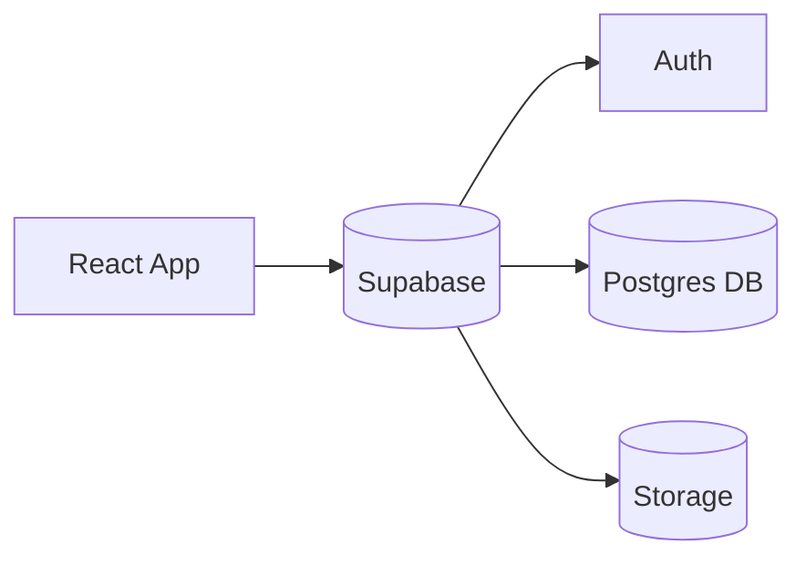

# Comic Reader

A comic library reader for public domain Golden Age comics. The app lets people browse a catalog, open a comic, and read chapters in a dedicated reader view.

## Features
- Browse a catalog of public domain comics
- Comic detail page with chapter list
- Reader view with next/previous navigation
- Sections for available and coming-soon comics
- Favorites library and profile page
- Ratings and comments
- User authentication

## Tech Stack
- React + TypeScript + Vite
- Tailwind CSS
- Supabase (Auth, Database, Storage)

## How It Works
**Frontend**
- The home page pulls the comics list and splits it into Available and Coming Soon sections.
- Comic cards link to a detail page that shows metadata and chapter list.
- The reader loads chapter pages and provides next/previous navigation.
- Auth-protected routes (favorites, activity, profile) require a signed-in user.

**Routing**
- `/` Home (catalog)
- `/comic/:id` Comic detail, ratings, and comments
- `/reader/:chapterId` Reader view
- `/favorites` Favorites library (auth required)
- `/activity` Ratings + comments history (auth required)
- `/profile` Profile editor (auth required)

**Backend (Supabase)**
- `comics` table stores comic metadata and a `coming_soon` boolean flag.
- Chapters and pages are loaded per comic in their respective tables.
- Favorites, ratings, and comments are stored in their own tables; activity is derived from them.
- Cover images and page assets are stored in Supabase Storage.
- Row Level Security (RLS) protects user-owned data (favorites, ratings, comments, profiles).

**Auth**
- Email/password auth via Supabase.
- Profiles are created on first sign-in and editable in the Profile page.

## Why This Project
- Preserve and present public domain Golden Age comics in a clean reader experience.
- This is a passion project and a portfolio piece showcasing a full stack app with auth, data modeling, and a reader UX.
- Practice product-level UX details like favorites, ratings, and activity tracking.
- I have a long-standing interest in comic collecting and regularly visit local comic shops with friends.
- Digital reading is practical, but I still value physical copies because they preserve the material history of the medium.
- Many older issues are difficult to find in good condition, so online access is often the most realistic way to read them.

## Architecture Diagram


## Data Flow
1. React components render pages based on the route.
2. Hooks fetch data from Supabase and return it to components.
3. User actions (favorite, rate, comment) write to Supabase.
4. UI refreshes by reloading hook data.

## Database Schema


**Core tables**
- `comics`, `chapters`, `pages`
- `favorites`, `ratings`, `comments`
- `profiles`

## Screenshots
**Mobile**


**Desktop**


## Running Locally
**Prerequisites**
- Node.js 18+
- npm

**Environment variables**
Create a `.env` file in the project root for local development:

```bash
VITE_SUPABASE_URL=your_supabase_url
VITE_SUPABASE_ANON_KEY=your_supabase_anon_key
```

**Install & run**
```bash
npm install
npm run dev
```

**Build**
```bash
npm run build
```

**Preview production build**
```bash
npm run preview
```

## Deployment (GitHub Pages)
- This is a static build hosted on GitHub Pages.
- Environment values are injected at build time; users do not see your local `.env` file.
- Only use public Supabase keys intended for client-side apps.
- For repo-based pages, set `base` in [vite.config.ts](vite.config.ts) to `/<repo-name>/`.
- GitHub Pages does not support SPA rewrites by default. Use hash routing or a 404 redirect if you need deep links to work on refresh.

## Notes
- This project is focused on public domain Golden Age comics.

